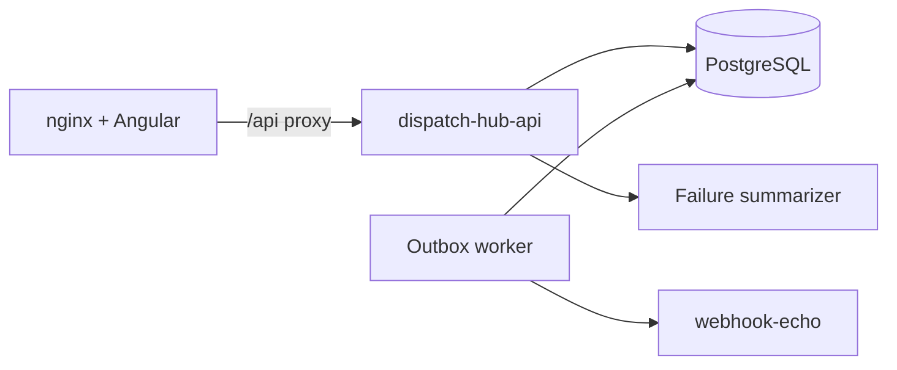

# Architecture

Dispatch Hub is a multi-tenant webhook dispatcher: tenants configure destinations, submit events, and an outbox worker delivers asynchronously with retries.

Compose publishes the UI on **:8080** and the API directly on **:8081**. Hybrid local runs can still use `ng serve` (:4200) against an API on :8080.

## Request path

1. Operator authenticates (`POST /api/v1/auth/login`) and receives a JWT scoped to one tenant + role.
2. ADMIN creates destinations and submits events with an idempotency key.
3. Event persistence and delivery jobs are written in one transaction (JPA).
4. Scheduled worker claims `PENDING` jobs with Spring Data JDBC (`FOR UPDATE SKIP LOCKED`).
5. Each claim runs SSRF checks, rate limiting, HTTP delivery, attempt logging, then SUCCESS / retry / DEAD.

## Tenant boundary

- JWT `tenant_id` must match path `{tenantId}`.
- Destinations, events, jobs, and attempts are always queried with tenant id.
- Egress allowlists are per tenant; global SSRF deny still applies.

## AI

`POST .../jobs/{id}/ai-summary` sends only sanitized attempt metadata to a `FailureSummarizer` port (mock or Spring AI OpenAI). No chat memory and no cross-tenant context.

## Production swap notes

| Demo | Later on VPS |
|------|----------------|
| DB outbox poller | RabbitMQ/SQS consumers |
| Caffeine rate limits | Redis shared counters |
| Single JVM worker | Separate worker process / replicas sharing claim SQL |
